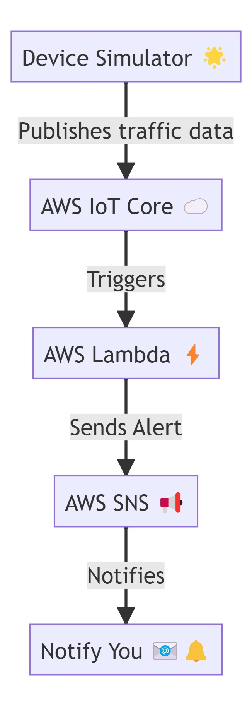

# 🚦 IoT Traffic Intensity Monitor: Keeping SA Roads Sane! 🚗💨

Welcome to **IoT Traffic Intensity Monitor** – your digital *traffic* (that's traffic in a South African accent) cop built with AWS! This project helps monitor simulated traffic intensity, because let's face it, Joburg rush hour feels like a herd of elephants stampeding through Sandton. 🐘🇿🇦

---

## 📌 Table of Contents
- [What's this about?](#-whats-this-about)
- [Architecture](#-architecture-diagrams-for-visual-people)
- [Setup Guide](#-setup-guide-strap-in-its-easier-than-navigating-cape-towns-lanes)
- [Usage](#-usage-how-to-avoid-being-a-robot-at-the-robot)
- [Contributing](#-contributing-we-need-more-hands-like-we-need-more-robot-repairs)
- [License](#-license)

---

## 🧐 What's this about?

This project simulates traffic monitoring using AWS IoT Core and Lambda. Think of it as a *virtual roadworthy check* for your cloud infrastructure. When traffic intensity hits over 50 (aka "Eish, this is worse than the N1 at 5 PM"), the system sends alerts via AWS SNS. Perfect for:
- City planners tired of guessing games
- Developers who hate real-life traffic but love simulating it
- Anyone who thinks "IoT" stands for *"I’m Obviously Tired"* of manual monitoring

---

## 📊 Architecture Diagrams (For Visual People)

### AWS Services Flow 🛠️




### Sequence Diagram 🤖➡️☁️


---

## 🛠️ Setup Guide (Strap In – It’s Easier Than Navigating Cape Town’s Lanes)

### Prerequisites
- An AWS account (obviously)
- Python 3.8+ (because Python 2 is so 2010)
- `pip` (the real MVP)
- AWS CLI (your new bestie)

### Steps:

1. **Clone this repo** – unless you enjoy typing code from scratch.
   ```bash
   git clone https://github.com/ZolisaSilolo/my-iot-core-app.git
   cd my-iot-core-app
   ```

2. **Install dependencies** (It’s like loading a taxi – quick and essential 🚕):
   ```bash
   pip install -r requirements.txt
   ```

3. **AWS Setup**:
   - Run `aws configure` and add your credentials (no skebenga moves here – keep them safe! 🔒).
   - **Create an IoT Thing** in AWS IoT Core. Name it something cool, like `TrafficBot_ZA`.
   - **Attach the IAM Policy** from `iot/iot_policy.json`. Pro tip: This policy is stricter than a mom checking curfew.

4. **Deploy the Lambda Function**:
   - Zip `lambda/lambda-function.py` and upload via the AWS Console.
   - Set the trigger to AWS IoT Core. Easy as koeksisters!

5. **Run the Device Simulator** (the real fun begins 🎮):
   ```bash
   python device/device_simulator.py
   ```

---

## 🚦 Usage (How to Avoid Being a "Robot" at the Robot)

- **Simulate Traffic Chaos**: Edit `device_simulator.py` to tweak intensity values. Pro tip: Set it to `100` to simulate Durban beachfront during December.
- **Subscribe to Alerts**: Hook the SNS topic to your phone. Get messages like:
  > "⚠️ Traffic Alert: Intensity 78! Better make some tea ☕ and wait."

---

## 🤝 Contributing (We Need More Hands – Like We Need More Robot Repairs)

Found a bug? Have an idea? **Submit a PR!** We’re keener than a Soweto derby crowd. Just follow these rules:
1. Write clean code (no spaghetti, please – we’re not making kota).
2. Test changes (because "it worked on my machine" is a kak excuse).
3. Add humor where appropriate (emoji tax: +1 🦄).

---

## 📜 License

MIT License – because sharing is caring, and we’re all just trying to survive load-shedding. ⚡🇿🇦

---

*Made with ❤️ in SA. Now go braai while this app handles the traffic.* 🍗🔥
